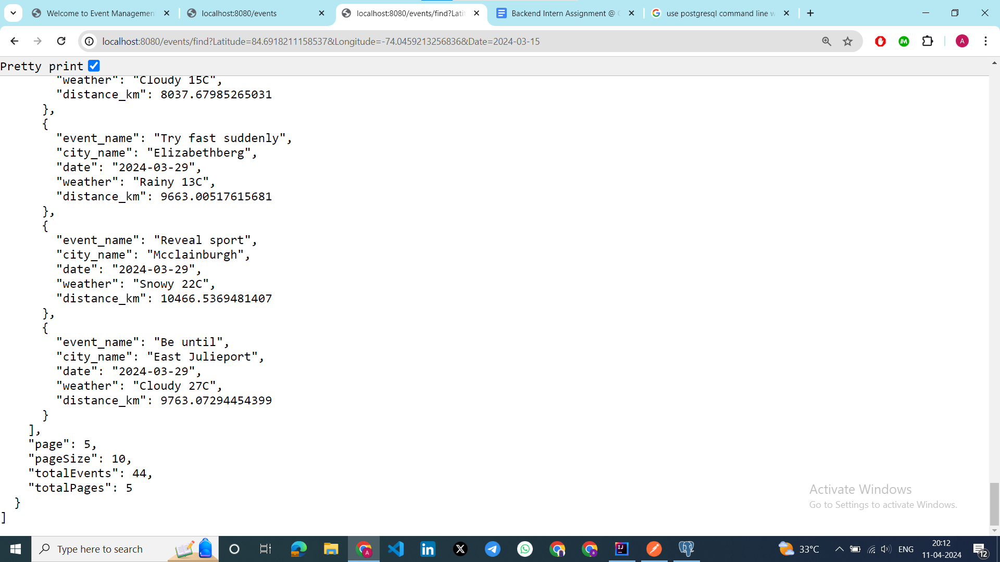

# Event Management System

## Project Overview
This repository contains an event management system developed as a backend assessment using Spring Boot, Java, and REST API. The system allows users to create events and find them based on location and date.

## Tech Stack and Database Choice
**Tech Stack:**
- **Spring Boot:** Chosen for its simplicity in creating production-grade Spring-based applications. It provides a comprehensive programming and configuration model for modern Java-based enterprise applications.
- **Java:** As a widely-used programming language with a vast ecosystem of libraries and frameworks, Java was selected for its reliability and scalability.
- **MySQL:** Chosen as the database management system due to its robustness, support for complex queries, and ACID compliance. MySQL is widely used and has strong community support.

**Design Decisions:**
- **Spring Boot:** Spring Boot simplifies the process of creating stand-alone, production-grade Spring-based applications. Its auto-configuration and starter dependencies reduce the amount of boilerplate code required, enabling rapid development.
- **REST API:** Using RESTful principles allows for a scalable and flexible architecture. It provides a standardized approach for communication between the client and the server, making it easier to integrate with other systems in the future.
- **MySQL:** MySQL was chosen for its feature-rich capabilities, including support for JSON data types, advanced indexing, and concurrency control. It is highly extensible and offers a wide range of data types and functions, making it suitable for handling diverse data requirements.

## Setup Instructions
1. **Prerequisites:**
    - Java Development Kit (JDK) installed ( 20.0.2  or above)
    - Apache Maven installed (version 4.0.0 or higher) or you can use maven wrapper bundled within spring boot project if you are using maven as build tool.
    - MySQL database server installed and running (version 16.1 or higher)
    - The above mentioned version is used in this project.

2. **Clone the Repository:**
```
git clone https://github.com/A-AnilKumar/eventmanagementsystem.git
```

3. **Configure the Database:**
- Create a new MySQL database.
- Update the database connection properties in the `application.properties` file with the appropriate database URL, username, and password.

4. **Build and Run the Application:**
````

cd eventmanagementsystem
mvn clean install
java -jar target/eventmanagementsystem.jar

````

5. **Access the API:**
- The API endpoints can be accessed as shown in below image
- `http://localhost:8080`


- API Documentation 
- `http://localhost:8080/api-docs`


- With post request to create a new event as shown in below image 

- `http://localhost:8080/events`
```
Sample Body of the Request 

{
        "eventName": "GyanGrove",
        "cityName": "Banglore",
        "date": "2024-4-15",
        "time": "11:30:00",
        "latitude": -12.971599,
        "longitude": 77.594566
}
```


- Retrieving all events in the database with get request as shown in below image
- http://localhost:8080/events


- Events based on user latitude , longitude and date
- http://localhost:8080/events/find?Latitude=userLatitude&Longitude=userLongitude&Date=date

- 





### Reference Documentation
For further reference, please consider the following sections:

* [Official Apache Maven documentation](https://maven.apache.org/guides/index.html)
* [Spring Boot Maven Plugin Reference Guide](https://docs.spring.io/spring-boot/docs/3.2.4/maven-plugin/reference/html/)
* [Create an OCI image](https://docs.spring.io/spring-boot/docs/3.2.4/maven-plugin/reference/html/#build-image)
* [Spring Web](https://docs.spring.io/spring-boot/docs/3.2.4/reference/htmlsingle/index.html#web)
* [Spring Data JPA](https://docs.spring.io/spring-boot/docs/3.2.4/reference/htmlsingle/index.html#data.sql.jpa-and-spring-data)

### Guides
The following guides illustrate how to use some features concretely:

* [Building a RESTful Web Service](https://spring.io/guides/gs/rest-service/)
* [Serving Web Content with Spring MVC](https://spring.io/guides/gs/serving-web-content/)
* [Building REST services with Spring](https://spring.io/guides/tutorials/rest/)
* [Accessing Data with JPA](https://spring.io/guides/gs/accessing-data-jpa/)


## Conclusion
The chosen tech stack and database provide a solid foundation for building a scalable, reliable, and performant event management system. By leveraging the features and capabilities of Spring Boot, Spring Data JPA, Hibernate, Java, and MySQL, the system can effectively handle the complexities of event creation and retrieval while ensuring data consistency and integrity.
